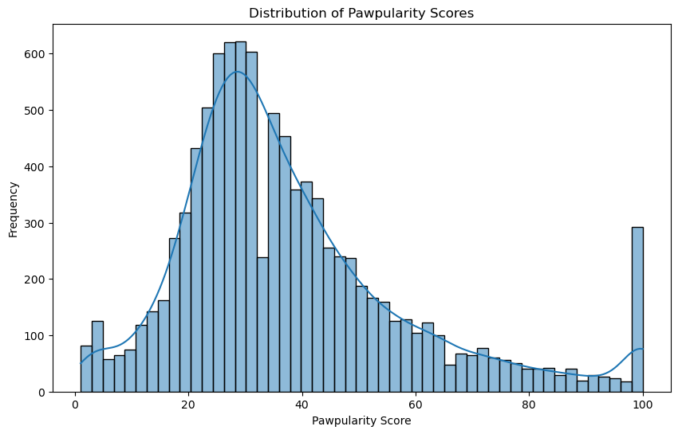
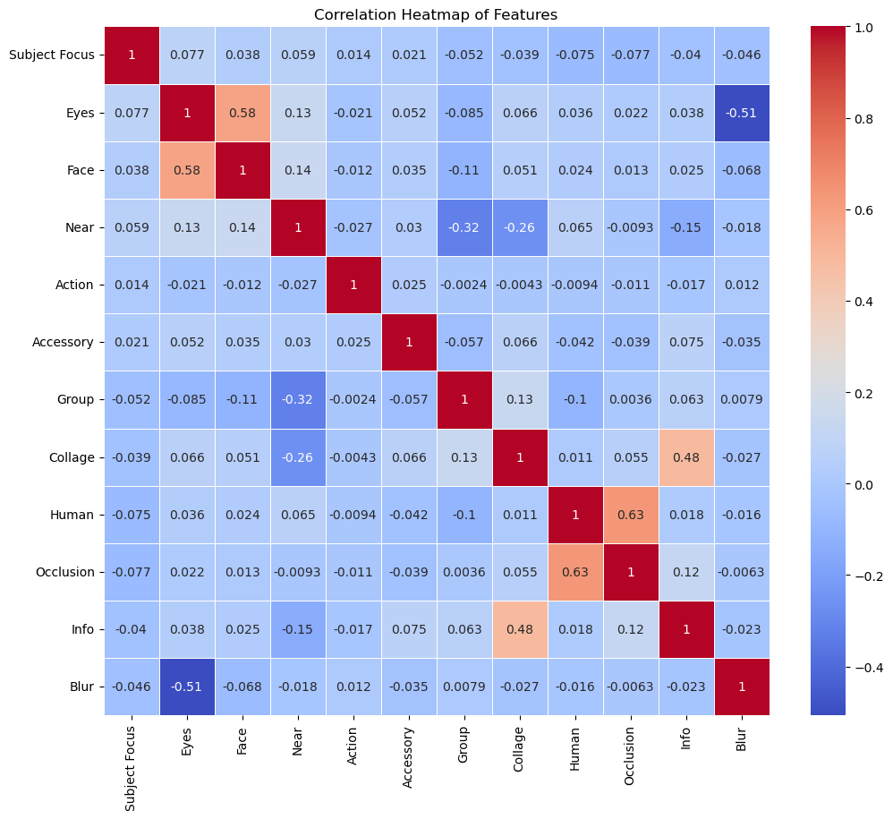
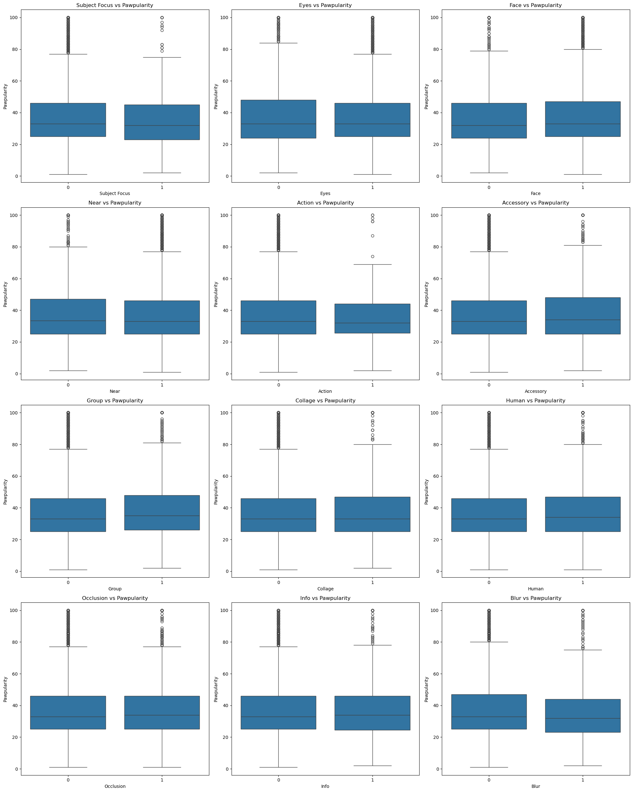
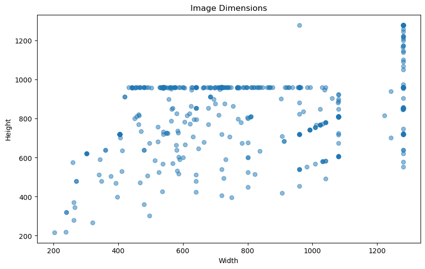
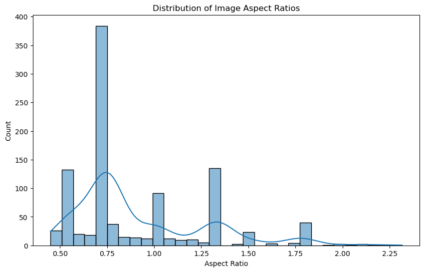
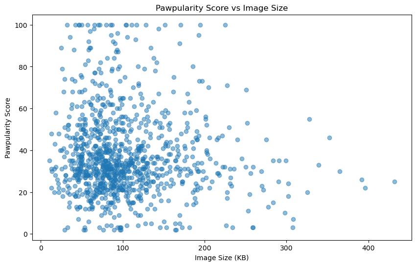

# PetFinder-Pawpularity
## 1. Description
###  Objective
The primary goal of this project is to develop a deep learning model that can predict the "Pawpularity" score of pet images. Pawpularity is a metric used by PetFinder.my to gauge the appeal of a pet's photo to online browsers, which can influence the pet's chances of adoption.
```
Training set size: 9912
Test set size: 8

Dataset Info:
Data columns (total 14 columns):
 #   Column         Non-Null Count  Dtype 
---  ------         --------------  ----- 
 0   Id             9912 non-null   object
 1   Subject Focus  9912 non-null   int64 
 2   Eyes           9912 non-null   int64 
 3   Face           9912 non-null   int64 
 4   Near           9912 non-null   int64 
 5   Action         9912 non-null   int64 
 6   Accessory      9912 non-null   int64 
 7   Group          9912 non-null   int64 
 8   Collage        9912 non-null   int64 
 9   Human          9912 non-null   int64 
 10  Occlusion      9912 non-null   int64 
 11  Info           9912 non-null   int64 
 12  Blur           9912 non-null   int64 
 13  Pawpularity    9912 non-null   int64 

Image Dimensions:
Image 1: (405, 720)
Image 2: (1032, 774)
Image 3: (720, 960)
Image 4: (405, 720)
Image 5: (540, 960)

Unique values in categorical columns:
Subject Focus: [0 1]
Eyes: [1 0]
Face: [1 0]
Near: [1 0]
Action: [0 1]
Accessory: [0 1]
Group: [1 0]
Collage: [0 1]
Human: [0 1]
Occlusion: [0 1]
Info: [0 1]
Blur: [0 1]
```

## 2. EDA







## 3 Architecture
